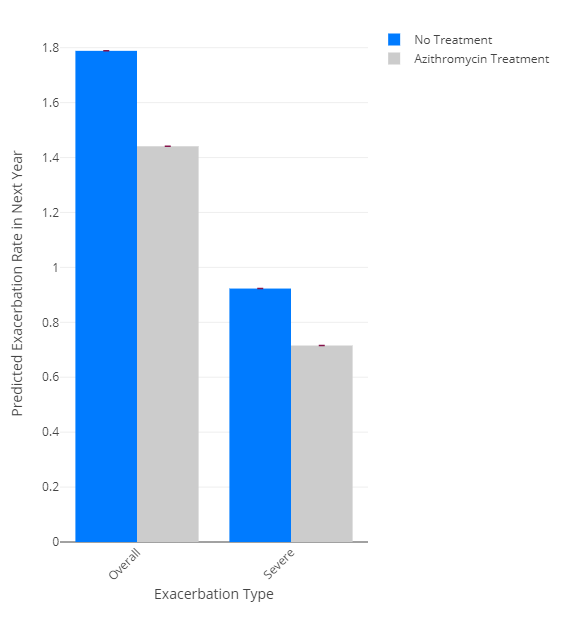
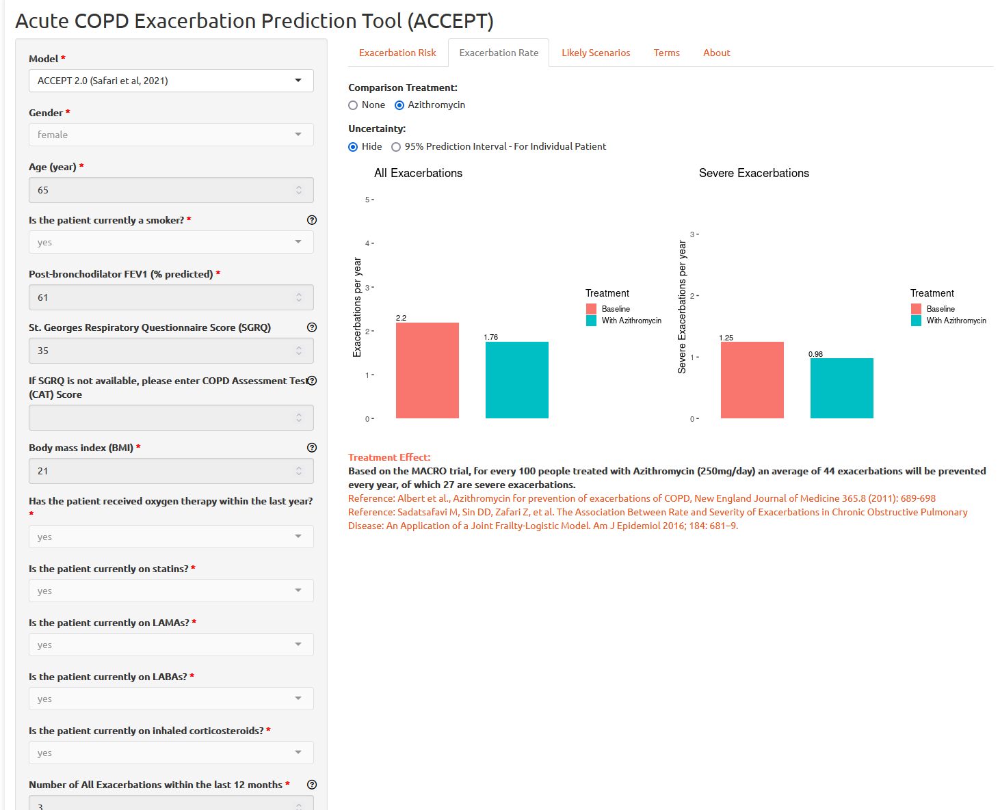

<!-- README.md is generated from README.Rmd. Please edit that file -->

```{r, include = FALSE}
knitr::opts_chunk$set(
  collapse = TRUE,
  comment = "#>",
  fig.path = "man/figures/README-",
  out.width = "100%"
)
```

# accept

<!-- badges: start -->

[](https://github.com/resplab/accept/actions/workflows/R-CMD-check.yaml)
[](https://cran.r-project.org/package=accept) [](https://cran.r-project.org/package=accept) [](https://www.repostatus.org/#active)
<!-- badges: end -->

R package for the ACute COPD Exacerbation Prediction Tool (ACCEPT)

ACCEPT is a prediction model for predicting probability, rate, and severity of exacerbations (also known as lung attacks) in patients with Chronic Obstructive Pulmonary Disease. The package now includes country-level random effects recalibration to improve prediction accuracy for different populations and healthcare systems.

ACCEPT has been developed by researchers at the University of British Columbia. Please refer to the published papers for more information:

Adibi A, Sin DD, Safari A, Jonhson KM, Aaron SD, FitzGerald JM, Sadatsafavi M. The Acute COPD Exacerbation Prediction Tool (ACCEPT): a modelling study. The Lancet Respiratory Medicine, Volume 8, Issue 10, 1013 - 1021; [doi:10.1016/S2213-2600(19)30397-2](https://doi.org/10.1016/S2213-2600(19)30397-2)

Safari, A., Adibi, A., Sin, D.D., Lee, T.Y., Ho, J.K., Sadatsafavi, M. and IMPACT study team, 2022. ACCEPT 2· 0: Recalibrating and externally validating the Acute COPD exacerbation prediction tool (ACCEPT). EClinicalMedicine, 51, p.101574. [doi:10.1016/j.eclinm.2022.101574](http://doi.org/10.1016/j.eclinm.2022.101574)

The following animation explains the `accept` model in 90 seconds:

[](https://www.youtube.com/watch?v=UuGLN128Z3Y)

## Installation

The latest stable version can be downloaded from CRAN:

`install.packages('accept')`

You can install the development version of accept from [GitHub](https://github.com/) with:

``` r
# install.packages("pak")
pak::pak("resplab/accept")
```

## Usage

The function `accept()` provides predictions from the latest version of the `accept` prediction model. `accept1()` provides predictions of exacerbations for COPD patients per original published manuscript. `accept2()` is an updated version of ACCEPT that is fine tuned for improved predictions in patients who do not have a prior history of exacerbations.

### Country-Level Random Effects

ACCEPT now supports country-level random effects recalibration to improve prediction accuracy for different populations. This feature adjusts the baseline risk predictions based on the observed exacerbation risk in your target population/country.

To use country-level random effects, you have two options:

1. Use the `country_recalibration` parameter:

```{r, eval=FALSE}
# Add observed risk for your population
your_data <- samplePatients
your_data$obs_risk <- 0.25  # 25% observed annual exacerbation risk in your population

# Apply country recalibration
results <- accept(newdata = your_data, country_recalibration = TRUE)
```

2. Use the dedicated `accept2_re` version:

```{r, eval=FALSE}
# Using the specialized country random effects version
results <- accept(newdata = your_data, version = "accept2_re")
```

Both methods require an `obs_risk` column in your data that represents the average observed risk of exacerbation in your target population. This value should be based on real-world data from your healthcare system or population of interest.

#### Parameters for `accept()` function:

- `newdata`: Patient data in tibble or data frame format
- `format`: Input format ("tibble" or "json")
- `version`: Model version ("accept1", "accept2", "accept2_re", or "flexccept")  
- `prediction_interval`: Whether to return prediction intervals (default: FALSE)
- `return_predictors`: Whether to return input predictors with results (default: FALSE)
- `country_recalibration`: Whether to apply country-level recalibration (default: FALSE)

When using country recalibration (`country_recalibration = TRUE` or `version = "accept2_re"`), the `obs_risk` column is required in your input data.

## Example

### Exacerbation Prediction

To get a prediction for exacerbation rate, you will need to pass in a patient vector. The accept package comes with a sample patient data tibble called `samplePatients`:

```{r}
library(accept)
accept(samplePatients) #accept uses the latest updated prediction model
```

**accept2()** and **accept1()** functions return a more detailed dataframe with the predictions for different treatment options with measures of uncertainty.

### Country-Level Recalibration Example

To use country-level random effects recalibration:

```{r, eval=FALSE}
# Create sample data with observed risk
data_with_obs_risk <- samplePatients
data_with_obs_risk$obs_risk <- 0.30  # 30% observed annual risk in your population

# Method 1: Using country_recalibration parameter
results_recal <- accept(newdata = data_with_obs_risk, 
                       country_recalibration = TRUE, 
                       return_predictors = TRUE)

# Method 2: Using accept2_re version
results_re <- accept(newdata = data_with_obs_risk, 
                    version = "accept2_re", 
                    return_predictors = TRUE)

# Compare with standard predictions
results_standard <- accept(newdata = samplePatients)

# View recalibrated vs standard predictions
print("Standard predictions:")
print(results_standard[, c("predicted_exac_probability")])

print("Recalibrated predictions:")
print(results_recal[, c("predicted_exac_probability")])
```

#### Technical Details for Country Recalibration

The country-level random effects recalibration uses the following approach:

1. Computes standard ACCEPT predictions for the patient
2. Applies a recalibration formula using:
   - Slope parameter: 0.9205
   - Cumulative baseline hazard: 0.2989  
   - Random effect: 3.064 × obs_risk - 0.858
3. Returns recalibrated risk estimates via complementary log-log transformation

This method has been validated to improve prediction accuracy when the baseline risk in your population differs from the original ACCEPT development cohorts.

### Visualization

To visualize the data, there is a graphing function called **plotExacerbations()**, which creates a Plotly bar graph. You have the option of selecting **probability** or **rate** for which prediction you want to see, and either **CI** or **PI** to select the confidence interval or prediction interval respectively.

```{r, eval=FALSE}
results <- accept2(samplePatients[1,])

plotExacerbations(results, type="probability")

plotExacerbations(results, type="rate")
```




### Probability of N Exacerbations (Poisson)

You can also calculate the predicted number of exacerbations in a year:

```{r}
results <- accept2(samplePatients[1,]) 
exacerbationsMatrix <- predictCountProb(results, n = 10, shortened = TRUE)
print(exacerbationsMatrix)
```

The shortened parameter groups the probabilities from 3-10 exacerbations into one category, "3 or more exacerbations." To see all n exacerbation probabilities:

```{r}
exacerbationsMatrix <- predictCountProb(results, n = 10, shortened = FALSE)
print(exacerbationsMatrix)
```

To visualize the matrix as a heatmap, we can use the function **plotHeatMap**:

```{r, eval=FALSE}
plotHeatMap(results, shortened = FALSE)
```


## Web App for ACCEPT

ACCEPT is also available as web app, accessible at <http://resp.core.ubc.ca/ipress/accept>



## API using vetiver and plumber

You can use vetiver and plumber packages to create, deploy, and monitor an API for ACCEPT:

```{r}
library(vetiver)
v_accept <- vetiver_model(accept, 
                   "accept-model")

```

To test to API locally, you can use

```{r, eval=FALSE}
library(plumber)
pr() |> 
    vetiver_api(v_accept) |>
  pr_run()
```

## Cloud-based API Access through Peer Models Network

The [Peer Models Network](https://resp.core.ubc.ca/show/pmnintro) allows users to access ACCEPT through the cloud. A MACRO-enabled Excel-file can be used to interact with the model and see the results. To download the PRISM Excel template file for ACCEPT, please refer to the [Peer Models Network model repository](https://models.peermodelsnetwork.com).

#### Python

```         
import json
import requests
url = 'https://prism.peermodelsnetwork.com/route/accept/run'
headers = {'x-prism-auth-user': YOUR_API_KEY}
model_run = requests.post(url, headers=headers,
json = {"func":["prism_model_run"],"model_input":[{"ID": "10001","male": 1,"age": 57,"smoker": 0,"oxygen": 0,"statin": 0,"LAMA": 1,"LABA": 1,"ICS": 1,"FEV1": 51,"BMI": 18,"SGRQ": 63,"LastYrExacCount": 2,"LastYrSevExacCount": 1,"randomized_azithromycin": 0,"randomized_statin": 0,"randomized_LAMA": 0,"randomized_LABA": 0,"randomized_ICS": 0, "random_sampling_N" : 100,  "calculate_CIs" : "TRUE"}]})
print(model_run)
results = json.loads(model_run.text)
print(results)
```

#### Linux Bash

In Ubuntu, you can call the API with `curl`:

```         
curl \
-X POST \
-H "x-prism-auth-user: REPLACE_WITH_API_KEY" \
-H "Content-Type: application/json" \
-d '{"func":["prism_model_run"],"model_input":[{"ID": "10001","male": 1,"age": 57,"smoker": 0,"oxygen": 0,"statin": 0,"LAMA": 1,"LABA": 1,"ICS": 1,"FEV1": 51,"BMI": 18,"SGRQ": 63,"LastYrExacCount": 2,"LastYrSevExacCount": 1,"randomized_azithromycin": 0,"randomized_statin": 0,"randomized_LAMA": 0,"randomized_LABA": 0,"randomized_ICS": 0, "random_sampling_N" : 100, 
"calculate_CIs" : "TRUE"}]}' \
https://prism.peermodelsnetwork.com/route/accept/run
```

## Citation

Please cite:

Adibi A, Sin DD, Safari A, Jonhson KM, Aaron SD, FitzGerald JM, Sadatsafavi M. The Acute COPD Exacerbation Prediction Tool (ACCEPT): a modelling study. The Lancet Respiratory Medicine. Volume 8, Issue 10, 1013 - 1021 [doi:10.1016/S2213-2600(19)30397-2](https://doi.org/10.1016/S2213-2600(19)30397-2)

Safari, A., Adibi, A., Sin, D.D., Lee, T.Y., Ho, J.K., Sadatsafavi, M. and IMPACT study team, 2022. ACCEPT 2· 0: Recalibrating and externally validating the Acute COPD exacerbation prediction tool (ACCEPT). EClinicalMedicine, 51, p.101574. [doi:10.1016/j.eclinm.2022.101574](http://doi.org/10.1016/j.eclinm.2022.101574)
