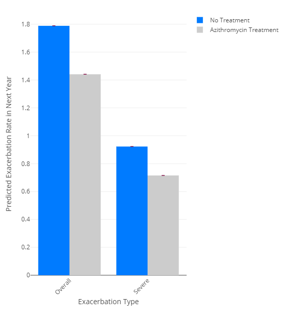
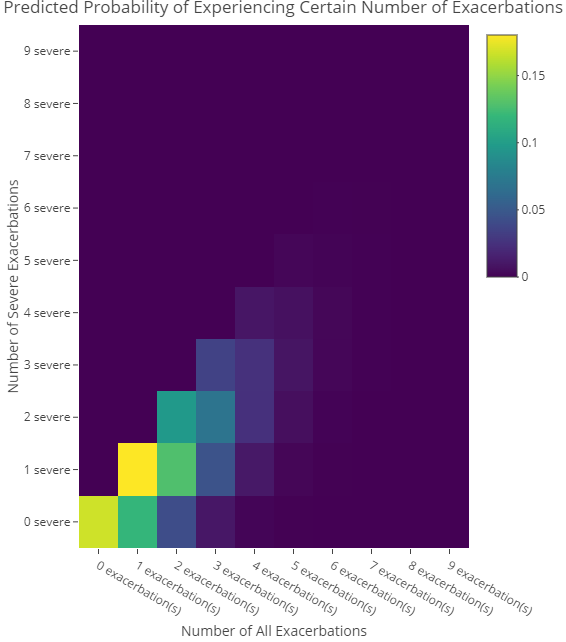
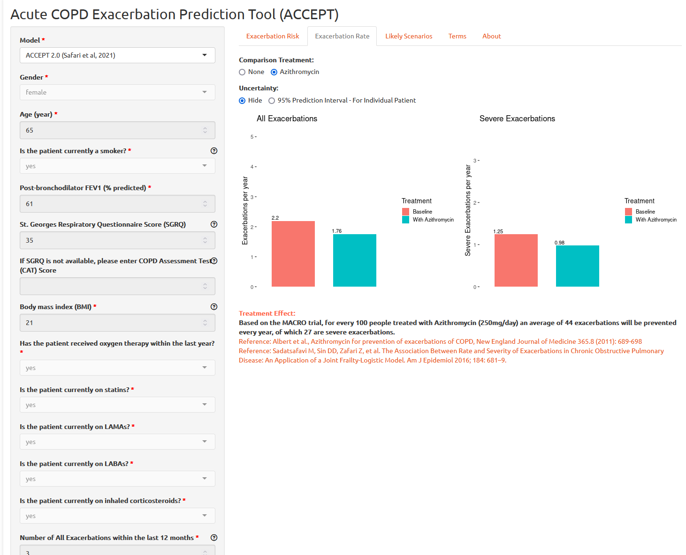

<!-- README.md is generated from README.Rmd. Please edit that file -->

# accept

<!-- badges: start -->

[](https://github.com/resplab/accept/actions/workflows/R-CMD-check.yaml)
[](https://cran.r-project.org/package=accept)
[](https://cran.r-project.org/package=accept)
[](https://www.repostatus.org/#active)

<!-- badges: end -->

R package for the ACute COPD Exacerbation Prediction Tool (ACCEPT)

ACCEPT is a prediction model for predicting probability, rate, and
severity of exacerbations (also known as lung attacks) in patients with
Chronic Obstructive Pulmonary Disease.

ACCEPT has been developed by researchers at the University of British
Columbia. Please refer to the published papers for more information:

Adibi A, Sin DD, Safari A, Jonhson KM, Aaron SD, FitzGerald JM,
Sadatsafavi M. The Acute COPD Exacerbation Prediction Tool (ACCEPT): a
modelling study. The Lancet Respiratory Medicine, Volume 8, Issue 10,
1013 - 1021;
[doi:10.1016/S2213-2600(19)30397-2](https://doi.org/10.1016/S2213-2600(19)30397-2)

Safari, A., Adibi, A., Sin, D.D., Lee, T.Y., Ho, J.K., Sadatsafavi, M.
and IMPACT study team, 2022. ACCEPT 2· 0: Recalibrating and externally
validating the Acute COPD exacerbation prediction tool (ACCEPT).
EClinicalMedicine, 51, p.101574.
[doi:10.1016/j.eclinm.2022.101574](http://doi.org/10.1016/j.eclinm.2022.101574)

The following animation explains the `accept` model in 90 seconds:

[](https://www.youtube.com/watch?v=UuGLN128Z3Y)

## Installation

The latest stable version can be downloaded from CRAN:

`install.packages('accept')`

You can install the development version of accept from
[GitHub](https://github.com/) with:

``` r
# install.packages("pak")
pak::pak("resplab/accept")
```

## Usage

The function `accept()` provides predictions from the latest version of
the `accept` prediction model. `accept1()` provides predictions of
exacerbations for COPD patients per original published manuscript.
`accept2()` is an updated version of ACCEPT that is fine tuned for
improved predictions in patients who do not have a prior history of
exacerbations.

## Example

### Exacerbation Prediction

To get a prediction for exacerbation rate, you will need to pass in a
patient vector. The accept package comes with a sample patient data
tibble called `samplePatients`:

``` r
library(accept)
accept(samplePatients) #accept uses the latest updated prediction model
#>      ID  male age smoker oxygen statin LAMA LABA   ICS FEV1 BMI SGRQ
#> 1 10001  TRUE  70   TRUE   TRUE   TRUE TRUE TRUE  TRUE   33  25   50
#> 2 10002 FALSE  42  FALSE   TRUE  FALSE TRUE TRUE FALSE   40  35   40
#>   LastYrExacCount LastYrSevExacCount predicted_exac_probability
#> 1               2                  1                  0.8327888
#> 2               0                  0                  0.4366622
#>   predicted_exac_probability_lower_PI predicted_exac_probability_upper_PI
#> 1                           0.1929329                           0.9924159
#> 2                           0.0000000                           0.8998712
#>   predicted_exac_rate predicted_exac_rate_lower_PI predicted_exac_rate_upper_PI
#> 1           1.7884977                    0.2143485                     4.881703
#> 2           0.5738758                    0.0000000                     2.301298
#>   predicted_severe_exac_probability predicted_severe_exac_probability_lower_PI
#> 1                         0.6026383                                 0.09371195
#> 2                         0.1085515                                 0.02547523
#>   predicted_severe_exac_probability_upper_PI predicted_severe_exac_rate
#> 1                                  0.9575906                  0.9229084
#> 2                                  0.4784134                  0.1149076
#>   predicted_severe_exac_rate_lower_PI predicted_severe_exac_rate_upper_PI
#> 1                          0.09839809                            3.160385
#> 2                          0.02580535                            0.650880
#>   azithromycin_predicted_exac_probability
#> 1                               0.7633086
#> 2                               0.3291975
#>   azithromycin_predicted_exac_probability_lower_PI
#> 1                                        0.1286904
#> 2                                        0.0000000
#>   azithromycin_predicted_exac_probability_upper_PI
#> 1                                        0.9793698
#> 2                                        0.8524301
#>   azithromycin_predicted_exac_rate azithromycin_predicted_exac_rate_lower_PI
#> 1                        1.4409981                                 0.1377579
#> 2                        0.3992806                                 0.0000000
#>   azithromycin_predicted_exac_rate_upper_PI
#> 1                                  3.880998
#> 2                                  1.913453
#>   azithromycin_predicted_severe_exac_probability
#> 1                                     0.51103045
#> 2                                     0.08544925
#>   azithromycin_predicted_severe_exac_probability_lower_PI
#> 1                                              0.07570494
#> 2                                              0.02469734
#>   azithromycin_predicted_severe_exac_probability_upper_PI
#> 1                                               0.9221162
#> 2                                               0.3567065
#>   azithromycin_predicted_severe_exac_rate
#> 1                              0.71545506
#> 2                              0.08932232
#>   azithromycin_predicted_severe_exac_rate_lower_PI
#> 1                                       0.07872393
#> 2                                       0.02500744
#>   azithromycin_predicted_severe_exac_rate_upper_PI
#> 1                                        2.5525368
#> 2                                        0.4411541
```

**accept2()** and **accept1()** functions return a more detailed
dataframe with the predictions for different treatment options with
measures of uncertainty.

To visualize the data, there is a graphing function called
**plotExacerbations()**, which creates a Plotly bar graph. You have the
option of selecting **probability** or **rate** for which prediction you
want to see, and either **CI** or **PI** to select the confidence
interval or prediction interval respectively.

``` r
results <- accept2(samplePatients[1,])

plotExacerbations(results, type="probability")

plotExacerbations(results, type="rate")
```




### Probability of N Exacerbations (Poisson)

You can also calculate the predicted number of exacerbations in a year:

``` r
results <- accept2(samplePatients[1,]) 
exacerbationsMatrix <- predictCountProb(results, n = 10, shortened = TRUE)
print(exacerbationsMatrix)
#>                         none severe   1 severe   2 severe 3 or more severe
#> no exacerbations         0.16721119 0.00000000 0.00000000       0.00000000
#> 1 exacerbation           0.11883372 0.18022310 0.00000000       0.00000000
#> 2 exacerbations          0.04222640 0.12808103 0.09712378       0.00000000
#> 3 or more exacerbations  0.01206628 0.05851757 0.10055944       0.07102149
```

The shortened parameter groups the probabilities from 3-10 exacerbations
into one category, “3 or more exacerbations.” To see all n exacerbation
probabilities:

``` r
exacerbationsMatrix <- predictCountProb(results, n = 10, shortened = FALSE)
print(exacerbationsMatrix)
#>                       0 severe     1 severe     2 severe     3 severe
#> 0 exacerbation(s) 1.672112e-01 0.000000e+00 0.000000e+00 0.000000e+00
#> 1 exacerbation(s) 1.188337e-01 1.802231e-01 0.000000e+00 0.000000e+00
#> 2 exacerbation(s) 4.222640e-02 1.280810e-01 9.712378e-02 0.000000e+00
#> 3 exacerbation(s) 1.000316e-02 4.551234e-02 6.902397e-02 3.489389e-02
#> 4 exacerbation(s) 1.777262e-03 1.078158e-02 2.452699e-02 2.479841e-02
#> 5 exacerbation(s) 2.526131e-04 1.915564e-03 5.810285e-03 8.811872e-03
#> 6 exacerbation(s) 2.992120e-05 2.722708e-04 1.032314e-03 2.087475e-03
#> 7 exacerbation(s) 3.037773e-06 3.224959e-05 1.467291e-04 3.708819e-04
#> 8 exacerbation(s) 2.698608e-07 3.274164e-06 1.737958e-05 5.271571e-05
#> 9 exacerbation(s) 2.130942e-08 2.908606e-07 1.764475e-06 6.244004e-06
#>                       4 severe     5 severe     6 severe     7 severe
#> 0 exacerbation(s) 0.000000e+00 0.000000e+00 0.000000e+00 0.000000e+00
#> 1 exacerbation(s) 0.000000e+00 0.000000e+00 0.000000e+00 0.000000e+00
#> 2 exacerbation(s) 0.000000e+00 0.000000e+00 0.000000e+00 0.000000e+00
#> 3 exacerbation(s) 0.000000e+00 0.000000e+00 0.000000e+00 0.000000e+00
#> 4 exacerbation(s) 9.402310e-03 0.000000e+00 0.000000e+00 0.000000e+00
#> 5 exacerbation(s) 6.682038e-03 2.026794e-03 0.000000e+00 0.000000e+00
#> 6 exacerbation(s) 2.374397e-03 1.440403e-03 3.640856e-04 0.000000e+00
#> 7 exacerbation(s) 5.624791e-04 5.118332e-04 2.587485e-04 5.605968e-05
#> 8 exacerbation(s) 9.993573e-05 1.212499e-04 9.194377e-05 3.984052e-05
#> 9 exacerbation(s) 1.420447e-05 2.154249e-05 2.178088e-05 1.415694e-05
#>                       8 severe     9 severe
#> 0 exacerbation(s) 0.000000e+00 0.000000e+00
#> 1 exacerbation(s) 0.000000e+00 0.000000e+00
#> 2 exacerbation(s) 0.000000e+00 0.000000e+00
#> 3 exacerbation(s) 0.000000e+00 0.000000e+00
#> 4 exacerbation(s) 0.000000e+00 0.000000e+00
#> 5 exacerbation(s) 0.000000e+00 0.000000e+00
#> 6 exacerbation(s) 0.000000e+00 0.000000e+00
#> 7 exacerbation(s) 0.000000e+00 0.000000e+00
#> 8 exacerbation(s) 7.552761e-06 0.000000e+00
#> 9 exacerbation(s) 5.367600e-06 9.044996e-07
```

To visualize the matrix as a heatmap, we can use the function
**plotHeatMap**:

``` r
plotHeatMap(results, shortened = FALSE)
```



## Web App for ACCEPT

ACCEPT is also available as web app, accessible at
<http://resp.core.ubc.ca/ipress/accept>



## API using vetiver and plumber

You can use vetiver and plumber packages to create, deploy, and monitor
an API for ACCEPT:

``` r
library(vetiver)
v_accept <- vetiver_model(accept, 
                   "accept-model")
```

To test to API locally, you can use

``` r
library(plumber)
pr() |> 
    vetiver_api(v_accept) |>
  pr_run()
```

## Cloud-based API Access through Peer Models Network

The [Peer Models Network](https://resp.core.ubc.ca/show/pmnintro) allows
users to access ACCEPT through the cloud. A MACRO-enabled Excel-file can
be used to interact with the model and see the results. To download the
PRISM Excel template file for ACCEPT, please refer to the [Peer Models
Network model repository](https://models.peermodelsnetwork.com).

#### Python

    import json
    import requests
    url = 'https://prism.peermodelsnetwork.com/route/accept/run'
    headers = {'x-prism-auth-user': YOUR_API_KEY}
    model_run = requests.post(url, headers=headers,
    json = {"func":["prism_model_run"],"model_input":[{"ID": "10001","male": 1,"age": 57,"smoker": 0,"oxygen": 0,"statin": 0,"LAMA": 1,"LABA": 1,"ICS": 1,"FEV1": 51,"BMI": 18,"SGRQ": 63,"LastYrExacCount": 2,"LastYrSevExacCount": 1,"randomized_azithromycin": 0,"randomized_statin": 0,"randomized_LAMA": 0,"randomized_LABA": 0,"randomized_ICS": 0, "random_sampling_N" : 100,  "calculate_CIs" : "TRUE"}]})
    print(model_run)
    results = json.loads(model_run.text)
    print(results)

#### Linux Bash

In Ubuntu, you can call the API with `curl`:

    curl \
    -X POST \
    -H "x-prism-auth-user: REPLACE_WITH_API_KEY" \
    -H "Content-Type: application/json" \
    -d '{"func":["prism_model_run"],"model_input":[{"ID": "10001","male": 1,"age": 57,"smoker": 0,"oxygen": 0,"statin": 0,"LAMA": 1,"LABA": 1,"ICS": 1,"FEV1": 51,"BMI": 18,"SGRQ": 63,"LastYrExacCount": 2,"LastYrSevExacCount": 1,"randomized_azithromycin": 0,"randomized_statin": 0,"randomized_LAMA": 0,"randomized_LABA": 0,"randomized_ICS": 0, "random_sampling_N" : 100, 
    "calculate_CIs" : "TRUE"}]}' \
    https://prism.peermodelsnetwork.com/route/accept/run

## Citation

Please cite:

Adibi A, Sin DD, Safari A, Jonhson KM, Aaron SD, FitzGerald JM,
Sadatsafavi M. The Acute COPD Exacerbation Prediction Tool (ACCEPT): a
modelling study. The Lancet Respiratory Medicine. Volume 8, Issue 10,
1013 - 1021
[doi:10.1016/S2213-2600(19)30397-2](https://doi.org/10.1016/S2213-2600(19)30397-2)

Safari, A., Adibi, A., Sin, D.D., Lee, T.Y., Ho, J.K., Sadatsafavi, M.
and IMPACT study team, 2022. ACCEPT 2· 0: Recalibrating and externally
validating the Acute COPD exacerbation prediction tool (ACCEPT).
EClinicalMedicine, 51, p.101574.
[doi:10.1016/j.eclinm.2022.101574](http://doi.org/10.1016/j.eclinm.2022.101574)
